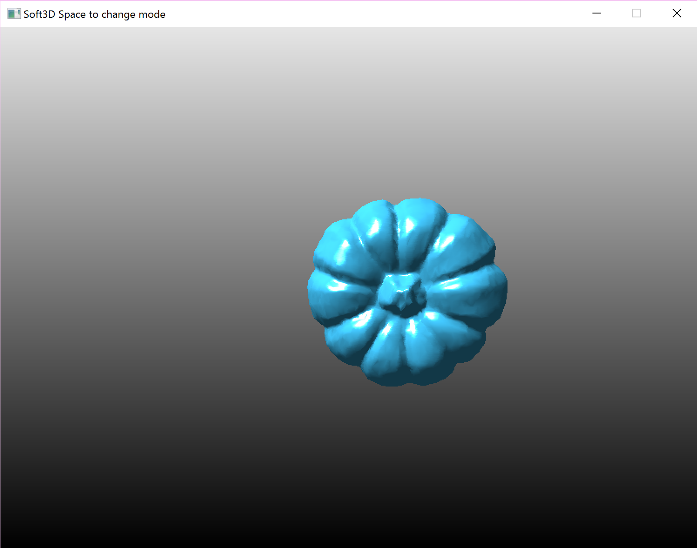

# Soft3D
* imitate D3D rendering pipline, implement a soft rasterizer 
* basic maxtrix&vector math library   
* D3D Left-Handed Coordinate System
* simple CVV,z-buffer triangle Scan-Line Filling
* simple vertex shader and pixel shader
* point light, parallel light, per pixel light, obj model file loading.

*	模仿D3D渲染管线，实现软件光栅化
*	实现基本的矩阵及向量等计算的数学库。
*	D3D左手坐标系，World View Projection三矩阵变换，屏幕坐标系变换。
*	简单CVV裁剪，三角形扫描线光栅化Vertex Shader 和pixel shader
*  点光源，平行光，逐像素着色，纹理映射， obj模型加载。

a blue pumpkin一只蓝色的南瓜

